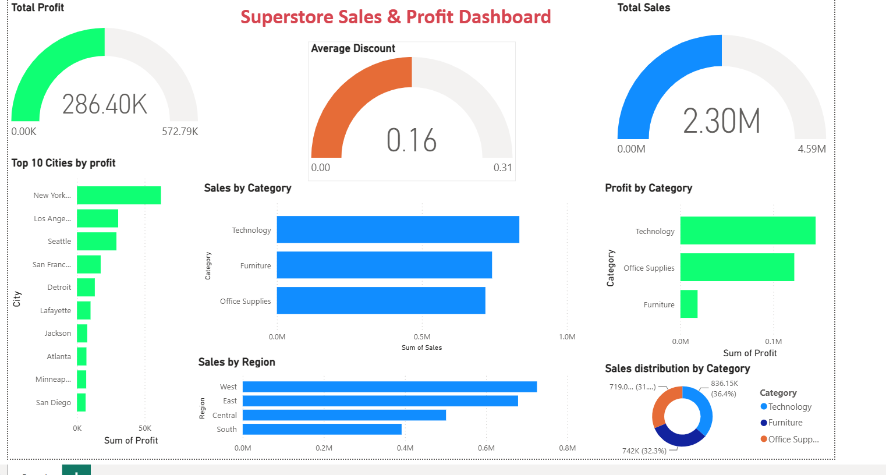

**Module 2 get started building with power BI**
# 📊 Power BI Beginner Dashboard – Sample Superstore Analysis

Welcome to my first Power BI dashboard project, created as part of the **Microsoft Learn – Data Analyst Career Path**.

In this project, I explored how raw retail sales data can be transformed into meaningful business insights using interactive dashboards and visualizations. The goal was to understand the Power BI workflow from importing data to building reports that support data driven decisionmaking.

**Dashboard Preview**

##  Project Objective

The objective of this project was to:

- Learn the Power BI interface and workflow
- Import and work with a real-world retail dataset
- Create interactive business dashboards
- Practice visualizing sales and profit metrics
- Present business insights in a clear and meaningful way

##  Dashboard Features

## Executive metrics 

-  Total Sales
-  Total Profit
-  Average Discount

### Business Visualizations

- Sales by Category
- Sales by Region
- Profit by Category
- Top 10 Cities by Profit
- Sales Distribution by Category

---

 **Skills Practiced**

During this project, I practiced:

- Importing CSV datasets into Power BI
- Building Bar and Column Charts
- Applying Top N Filters
- Formatting dashboards and visuals
- Organizing reports for better readability

---

##  Dataset

**Dataset:** Sample Superstore Dataset (CSV)
- this dataset contains retail sales information including sales, profit,discount, category,region and city and was used to build the interactive Power BI dashboard 

## Learning source
-This project was completed as a part of the **Microsoft learn - data analyst career path**
-Module 02 -get started building with Power BI 

---

**Key Takeaways**

By this project i built my first  intractive Power BI dashboard that helped me understand the complete Power BI dashboard creation process from loading data to creating meaningful visualizations.

It also strengthened my understanding of how business intelligence tools can transform raw data into insights that support better business decisions.

---

